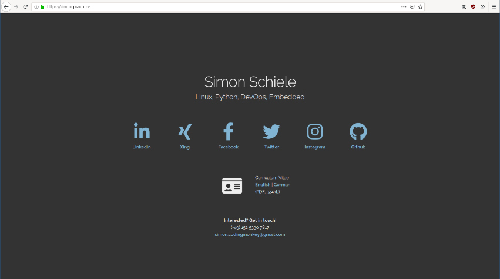

# Personal Website
> Minimal Version - based on skeleton framework

## Description

My personal website. I'm using this mostly when applying for new jobs. It is using font-awesome and the skeleton css framework. JavaScript free and responsive! :-)

You can find the live version at: <https://simon.psaux.de>

#### Desktop

#### Mobile

## Setup

Adjust the index file to your likings and put external depends in place:

* css/skeleton.css (-> <http://getskeleton.com/>)
* normalize.css (-> <https://necolas.github.io/normalize.css/>)
* css/all.css (-> <https://fontawesome.com/>)
* webfonts/fa-* (-> <https://fontawesome.com/>)

## License

For my code/layout MIT License applies. Does not touch/change anything about Licenses of used libraries. Used libs are not included anyway.

## Author
Simon Schiele (<simon.codingmonkey@gmail.com>)
